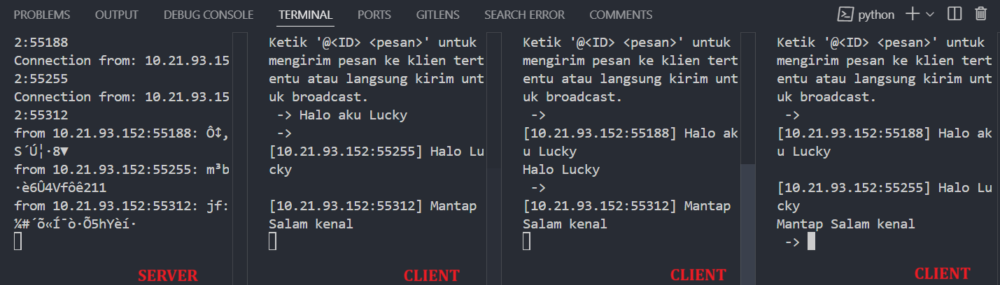

| Name          | NRP        | Kelas                 |
| ------------- | ---------- | --------------------- |
| Lucky Santoso | 5025221050 | Keamaan Informasi (B) |

# About Program

Program ini dibuat untuk melakukan komunikasi terenkripsi antara client ke server dan client ke client, dimana secara fitur program dapat melakukan :

**1. Broadcast ke seluruh ke client**

Cara kerjanya adalah client mengirimkan pesan terenkripsi ke server, kemudian server mengirimkan pesan yang terenkripsi tersebut ke semua client yang tersambung dengan server

**2. Pengiriman pesan dari client ke client tertentu**

Cara kerjanya adalah client mengirimkan pesan disertai tag "@id-client" tertentu, dimana server akan meneruskan pesan hanya ke client sesuai dengan id yang disertakan.

# Testing

**Broadcast**

**Client to Client**

